### Introduction

Have you ever wondered how a website opens when you click on it? Well, I certainly did and I started looking for answers. Now that I’m a couple of years into this journey, I have developed a certain level of understanding and I’ve presented a rudimentary explanation in this blogpost.

I've taken a top-down approach in explaining the concept, so you can always maintain a connection with what has been mentioned before. That also means you can discontinue reading at any point and you’ll be able to leave with a cohesive understanding of this concept, the depth of which will depend on how far you've read. In my opinion, a top down approach also creates a higher sense of appreciation for the engineering under the hood, especially in the context of networks.

### Level 0: The Basics

Okay, so what exactly is the thing you do to open a website first? Click a link, ideally. The link usually looks something like `https://website.com/home`. As soon as you click the link, the process is initiated by your browser (Chrome, Firefox, Edge …). It sends a request to the server that corresponds to “website”. The server then responds with the details of the “website” that the browser needs to display all the text, images etc. on your screen. 

You might wonder what the browser requests in order to display all the details. Well, it turns out, the browser doesn’t actually request for any detail. It simply sends a `GET` request to the server, and whatever the server sends, it simply renders that. The server decides what to send based on the request. More specifically, it sends an `HTML` document. Browsers have the ability to read only `HTML (HyperText Markup Language)`, `CSS (Cascading Style Sheets)` and `JS (JavaScript)`. The HTML document sent has requests embedded in itself for the CSS and JS documents that the website requires. These requests get processed similarly and the browser then gets all the elements it requires to construct the website and it simply does that.

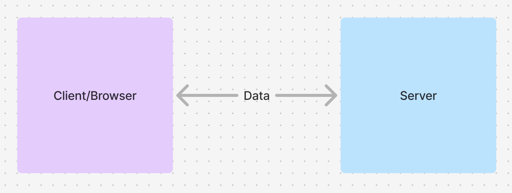
### Level 1: Languages

We discussed HTML, CSS and JS in the previous section. The three of them have a very defined purpose *viz.*

1. HTML - Skeletal structure of the website
As mentioned above, the HTML document is the first thing sent to the browser as it is the skeleton on which the browser needs to add a body. It is enough for rendering text and text only. This also includes basic constructs like buttons, lists, tables and so on. The `header` (keep this word in mind, it’s a very frequently used one) of the HTML file contains requests to the CSS and JS files. It’s not mandatory to have them, but websites do usually have them. The last thing that HTML is responsible for, is allotting actions to the components (like clicks).

2. CSS - Beautification of the website
These requests usually get processed really fast and we don’t notice any live changes, but sometimes when you have a bad network connection, you might notice certain websites rendering in a very vanilla manner. This is because the CSS file has not been received and all you’re seeing is raw HTML. After the CSS file is received, the browser goes through it and applies all the effects on elements by searching for them. These effects include stuff like font styles, backgrounds, animations and so on.

3. JS - Functionality in the website
This revolutionary language, that can run on the browser and the server shifted the tides of web development. It allows you to make your website interactive. It makes websites something more than “information pages”. Say you have a form that you need on your website. While you can use HTML to render that form and CSS to make it look really good, without JavaScript there’s no way you can send that information to your server. In this case the JavaScript code will `POST` your form data to your server.

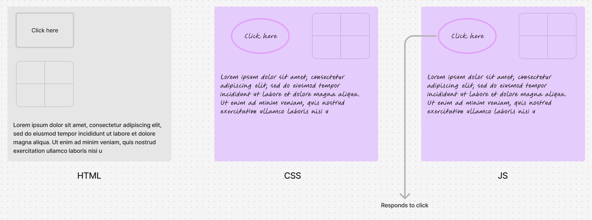
### Level 2: Beyond the Browser

Everything covered until this point was happening at the user’s end of this entire process. It was all being left at “sent a request”. What happens to this request? How does this get processed? How is a response sent?

In short, the server is responsible for handling requests. You might have noticed certain randomly highlighted words like `GET` and `POST` during this read. Well, they’re not random. Remember `HTTPS` from the first section? It stands for `HyperText Transfer Protocol`. This is what dictates the behaviour of the request and response. `GET` and `POST` are 2 types of `HTTP` requests. There are also `DELETE`, `PUT`, `PATCH` etc.

As soon as the server receives an `HTTP` request, it looks at two things:
1. Type of request - `GET`, `POST` $\dots$ 
2. Path/route of request - `/home`, `/about` $\dots$

**Note**: A server can be written in multiple languages, but for simplicity I’ve used the example of JS here.

Depending on these two, the server will accordingly call a JS function that will handle the request and send a meaningful response. For example, if you’re on YouTube, when you watch a video you `GET /video`, but when a creator upload a video, they `POST /video`. These two requests have to be handled differently. Similarly when you’re loading the comments, your browser is sending both `GET /video` and `GET /comments` to the server and they need to be handled differently as well. Therefore both of these parameters are essential to decide the exact flow of the request.

After the request is processed in one of the JS functions, the server sends a corresponding response back to the browser with the data it requested. For example `GET /comments` would send the list of comments and `POST /comment` might decide not to send back anything since it’s only mean to “POST”.

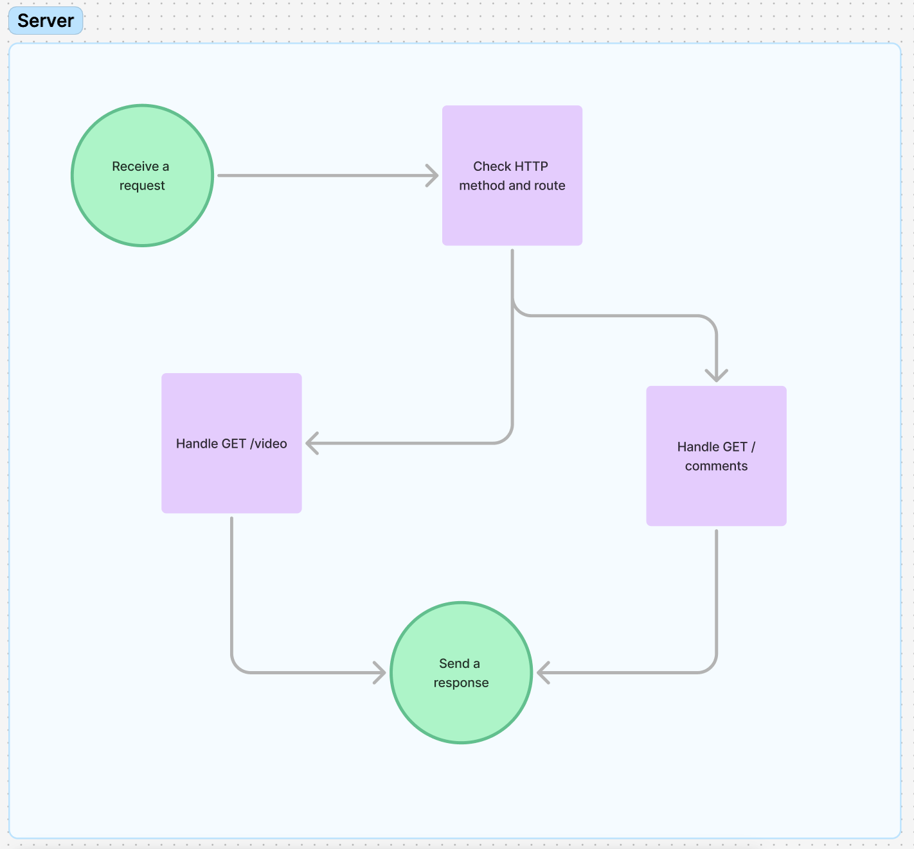
### Level 3: Protocols

Protocols are the decision makers that dictate the behaviour of the website and any web application involves a truckload of protocols under the hood. We’ve already discussed `HTTP` which is one of the most frequently used ones, primarily because most requests are user initiated and anything to do with the user involves `HTTP`.

Taking a few steps back, remember how we opened the website in the first place? We clicked a link `https://website.com` and the browser sends a request $\dots$ we know that. But how does it know where to send the request in this huge World Wide Web. We now know the meaning of the first part *i.e.* `HTTP`. If you’re wondering what the “S” stands for “secure”. It comes from another protocol called `SSL (Secure Socket Layer)`. The other half of the link “website.com” denotes the address of the website in the entirety of the World Wide Web. This is why each domain represents a unique website. It doesn’t however uniquely represent a website. How does that work? The string of characters `website.com` by itself has no meaning in the context of the Internet which only understands numbers. Therefore, `website.com` needs to be mapped to a number that the Internet can understand. What is this number? It’s just the `IP (Internet Protocol)` address of the server corresponding to the website. Since IP addresses are globally unique to each machine, the browser knows which machine to send a request to. This string of characters is called a “domain” and as you probably guessed, we can map multiple domains to an IP, hence the non unique representation of a website mentioned previously. Owing to the word “domain”, the protocol that allows this string to IP mapping is called `DNS (Domain Name Server)`. To sum up, the first request that a browser sends is a DNS request to an Internet-wide common registry to find out which IP it needs to send it’s HTTP requests to.

**Note:** This is where services like `Cloudflare` are used.

This isn’t the end of protocols, there’s much more to them and we’ll revisit this later.

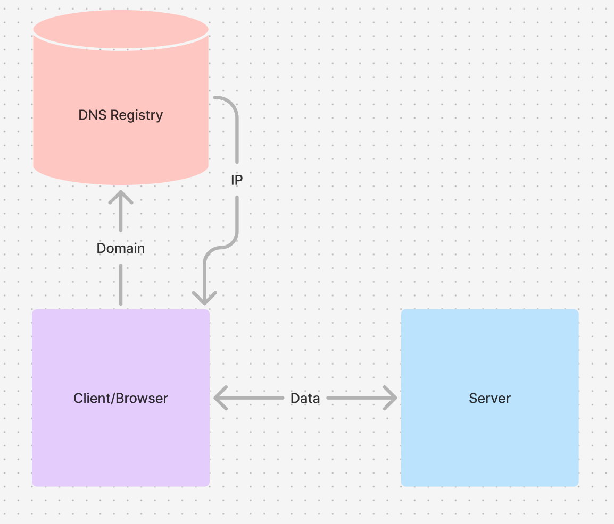
### Level 4: Capturing a Request

There are two types of IP addresses viz. `v4` and `v6`. Here we deal with `v4` for simplicity. Say the domain `website.com` gets resolved to `255.144.211.192`. The dots in between are just separators created for reading this IP easily. Each dot represents an integer ranging from 0 to 255. Why 255? It’s because the number is an 8 bit integer which can have a maximum possible of 255. Therefore in total, the `IPv4` address is 32 bits long. 

Since all requests are being sent to the same IP, how do we differentiate between protocols? The answer is `ports`. What are “ports”? They’re just numbers that denote processes running on a computer. Each port has a unique process running on it. Therefore the process that handles `HTTP` requests will have a specific port *i.e.* `80` (not exactly for HTTP but can be assumed for the time being). This number is not random, it’s the convention that is followed in every computer. Similarly, `DNS` requests are sent to port `53` and `SSL` requests are sent to port `443` just to name a few protocols we've covered already. Note that IP doesn’t correspond to a port because it is not a machine level construct (explained in more detail below).

Now that we know all the requests corresponding to `website.com` will be received at `255.144.211.192:80`, we can run a process on port `80` to deal with each request. Turns out, we don’t have to run this process because our machines already do it for us because it is such an essential that it has been standardised across platforms. Contrary to basic intuition, a website might require multiple processes running on the server to deal with different requirements. You might ask why and the answer is multi fold. It helps with balancing the load on the server, dividing your responsibilities between processes *etc.* Revisiting the YouTube example, `/comments` and `/video` might have different processes handling their requests. Therefore, the requests corresponding to these routes need to be routed to different processes I.e different ports, yet again. Say the ports handling them are `4000` and `5000` respectively. We have the ability to read the `HTTP` request and look for the routes and consequently route them to different ports within the machine. This process can then look for the `GET` or `POST` (or one of the other methods) along with a sub route like `/video/public` to take an action.

**Note:** This is where services like `Nginx` and `Caddy` are used.

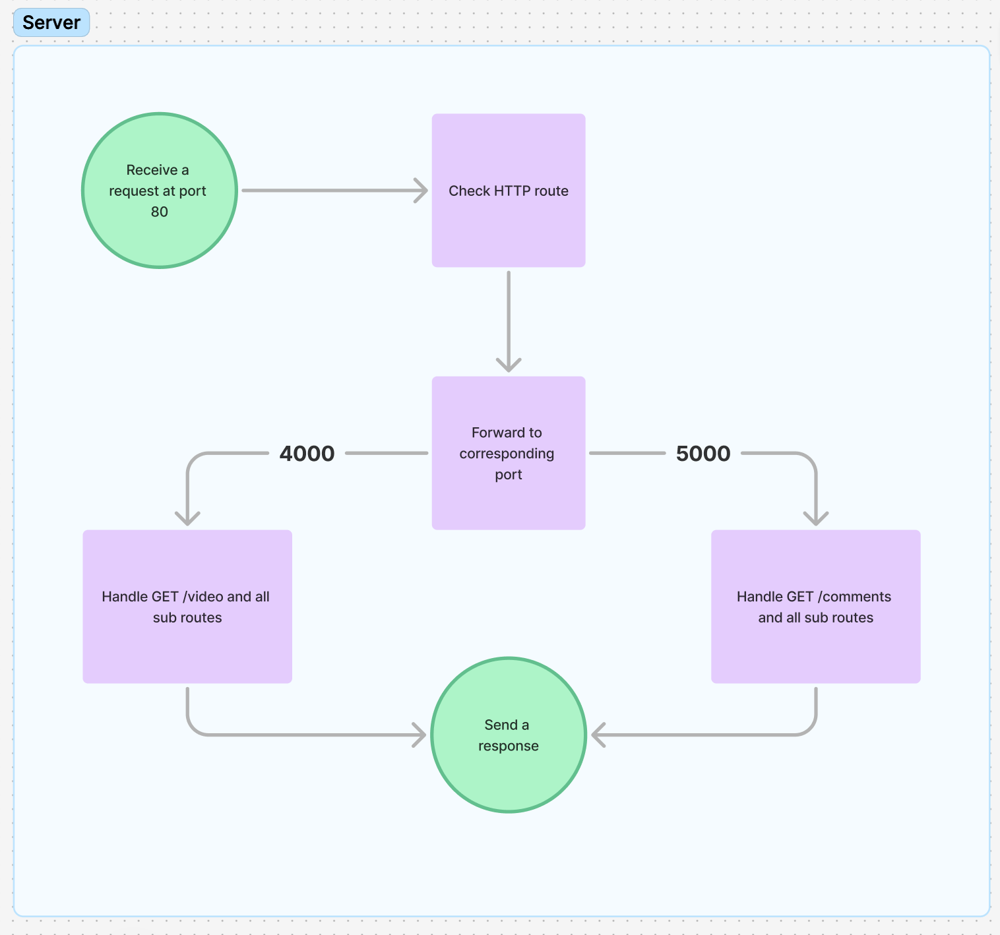
### Recapitulation (Levels 0 - 4)

1. Click on a link
2. Browser sends a `DNS` request to the common registry to find the `IP`
3. Send an `HTTP` request to the `IP` (port `80` by default)
4. Server processes the request at port `80` and forwards to say port `4000`
5. The process in port `4000` sends an `HTML` file back to the browser
6. The browser reads the `HTML` and files and goes through the header first
7. It simultaneously renders the page with the elements present in the `HTML` file
8. The header asks for `CSS` and `JS` files
9. The requests are processed similarly and the website comes to life

Pfff, that was quite a lot, wasn’t it? Well things are about to get messier.

### Level 5: Revisiting Protocols

So far, we've answered the **what** and **where** of our HTTP requests. To clarify, the **what** being the request route for example `GET /video` and the **where** being the IP address of the server. One important question that we're yet to encounter is the **when** and it is perhaps the most complicated one.

We've been glossing over a concept called the `Open Systems Interconnection (OSI)` model. Everything that has been mentioned in this blogpost is an aspect of this model. It primarily has `7 layers` *viz.* `L1 - L7` where L7 is the Application Layer and the lower you go down, the closer you get to the Physical Layer *i.e.* L1. Protocols like `HTTP` and `DNS` fall under L7 and others like `IP` fall under L3. Here we cover a protocol called `TCP (Transmission Control Protocol)` that falls under L4. As the name suggests, it's responsible for the transmission/transport of `packets`.

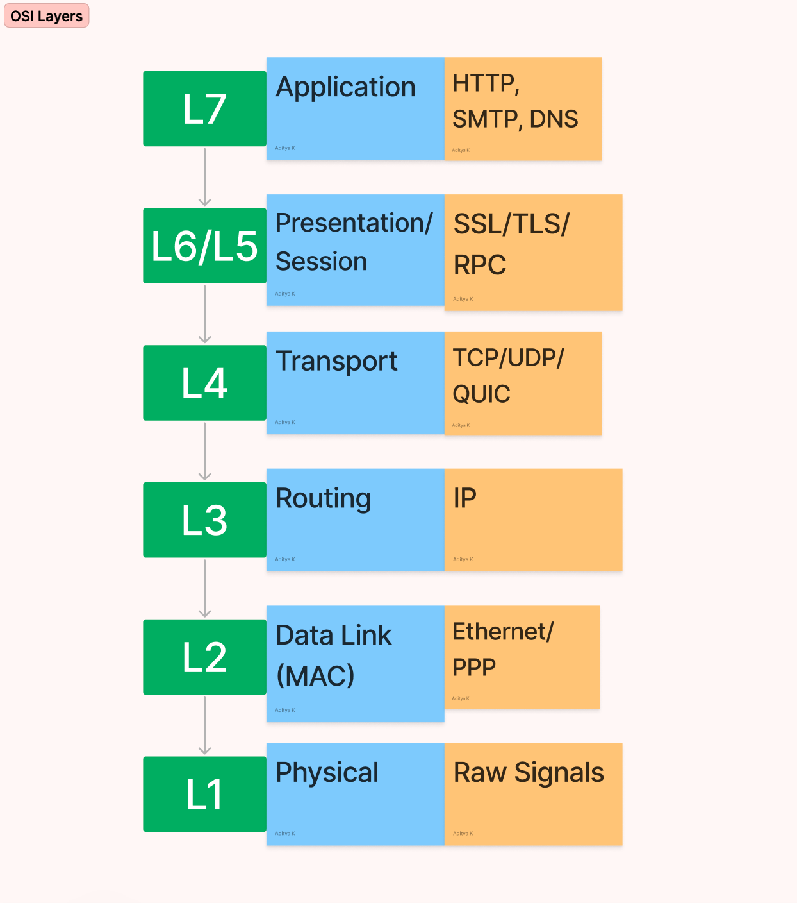

A `packet` can be understood as a chunk of information that the Application Layer has sent. Since L7 is allowed to generate as much data as it wants, the standardisation comes at L3 where an internet packet is limited to the size of `64KB`. This is done so that there is more reliability in sending and receiving data. For example, a high resolution is image is being transferred over the internet and there is some issue mid way, the entire process will have to start over if there is no fragmentation of data. This obviously takes a lot of time and other resources, hence it's usually best to follow this practice.

**Note:** The definition of a packet changes based on the layer of operation. A TCP packet has a TCP header and an L7 body while an IP packet has an IP header and an L4 body. Each layer adds its own header to the previously existing packet and operates as per the rules of that layer's selected protocol.

**Note:** Remember the spot where I mentioned that port `80` is not exactly for `HTTP`. It's actually meant for any `TCP` packet. It might make more sense now because HTTP has no meaning when being transported from a router to a machine.

TCP is mainly responsible for 2 things
1. Flow Control - Which fragment to send
2. Congestion Control - When to send the selected fragment

Flow Control is based on the perspective of the end-to-end sender/received observations, whereas Congestion Control is based on the perspective of the routers that are forwarding these requests.

##### Flow Control

Each fragment (`segment` in TCP terms) is assigned a `sequence number` which is used to denote the position of the packet among the others within that request. There are multiple algorithms that TCP operates with like
- `GBN` (Go back N)
- Cumulative ACK (`CACK`)
- Selective ACK (`SACK`)

These are all *sliding window* protocols where there are multiple packets *in-flight*. A very trivial implementation is just sending each packet one-by-one.

We'll discuss `GBN` here for simplicity. Now that we have divided the HTTP request into segments and assigned each of them a sequence number, we're ready to transmit them. But what order do we exactly transmit them in? How do we start? The answers to these questions are simple. We transmit them in the order of the sequence number and we start with sequence number `0`.

TCP operates on the principle of `SYN/ACK` which stands for *synchronize* and *acknowledge*.
The connection establishment is a *3-step handshake*
- The client sends a `SYN` packet to check if the server is ready for a TCP connection.
- The server responds with an `SYN-ACK` indicating that the server is ready for a connection.
- The client then sends an `ACK` confirming the connection.

Along with this, the client sets a window size say `5` and sends it in the header to the server to let it know how many packets it can expect to receive in a buffer and *vice versa*. This means that there are at most `5` packets that are currently *in-flight* from the sender's perspective (the receiver can have a different window size).

In `GBN`, the window size is simply `N` *i.e.* `5` in this case. Also, keep in mind that the receiver has to send ordered `ACK`s for `GBN`. These are the steps that are followed while transmitting an HTTP request:
1. Transmit packets numbered `0 - 4` (inclusive, since *window size = 5*).
2. Wait for `ACK`s.
3. As the `ACK`s come in, say we received `ACK0` and `ACK1`, shift the window and transmit packets numbered `5` and `6`. Now the packets *in-flight* are `{ 2, 3, 4, 5, 6 }`.
4. Suppose there is an issue with packet `2` and it gets dropped somewhere, the server doesn't send `ACK2`. After a certain amount of time *i.e.* `RTO (Request Timeout)`, the sender transmits the entire window again (evidently, this can be wasteful, hence `CACK` and `SACK` are more widely used).
5. Wait until all `ACK`s have come through and then order the packets with their sequence numbers to re-create the initial `HTTP` request.

**Note:** The `RTO` is usually set on some heuristic based on the `Round Trip Time (RTT)` *i.e.* the expected time it takes for a packet to be sent and received for a particular client-server pair.

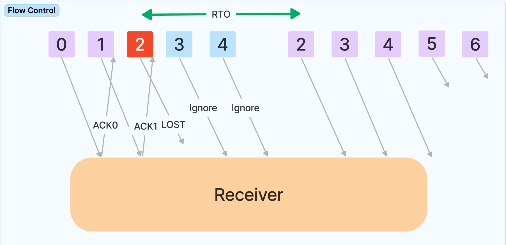
##### Congestion Control

What if you could just keep sending all of your packets and keep waiting for individual `ACKs` and just order them as and when you receive them? Sounds great right? But that's not so good for the other users sharing your network. If you could do that, you're basically blocking the common router's bandwidth and taking up more resources than you should. And if everybody starts doing this, then it's just anarchy.

Therefore another layer is required to tell TCP how much its allowed to transmit per user. This algorithm basically adjusts the window size set initially. Again, there are multiple algorithms:
- TCP Reno
- TCP New Reno
- TCP BBR (Bottleneck Bandwidth and Round-trip propagation time)
- TCP Vegas
- $\dots$

And yet again for simplicity, I've chosen to explain TCP New Reno here. It starts with a simple algorithm called `slow start`:
1. The sender initialises it's window to something small like `1` or `2` segments
2. For each `ACK` that the sender receives, the window size doubles (exponential growth)
3. This is done until it hits a particular threshold (can be pre-decided or dynamically decided based on metrics)
4. After the threshold is hit, we enter a phase called *congestion avoidance*. Here the window sizes grows linearly for each `ACK`.
5. As soon as packet loss is encountered (indicated by RTO or duplicate `ACK`s in the case of `CACK` and `SACK`), the window size is reset to its minimum value and the `slow start` happens again. Also, the threshold is updated to a newer reduced value in order to find the optimal window size.

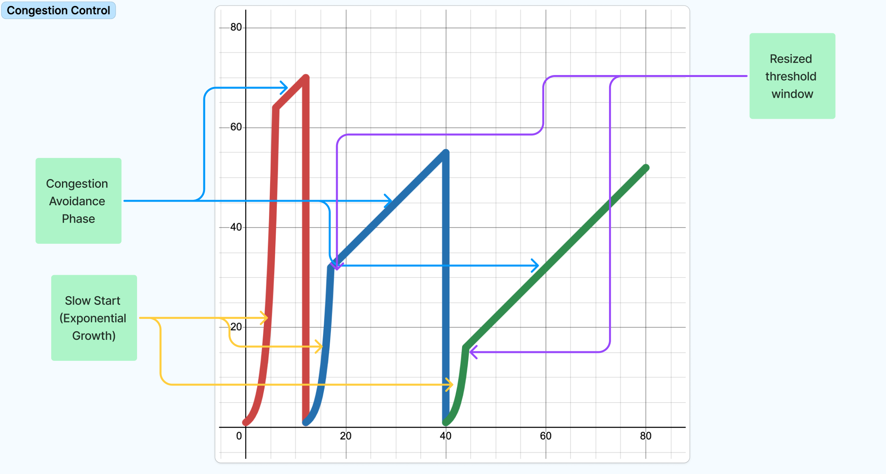

Hence, the process of *flow control* and *congestion control* happen simultaneously as a part of TCP. This is a best effort service for minimum time for end-to-end transportation of a packet along with ensuring fairness for other users.

### Level 6: Connections

The *best effort* service described in the previous section refers to a particular method of sending packets *viz.* `packet switching`. In this method, each packet is treated independently by each entity whether end host or an intermediate router. Well what if we don't want "best effort"? What if we want guaranteed service metrics?

There's another method called `circuit switching`, the basic principle of which is *context*. This refers to the context of which packet is expected to be received/forwarded at a router level. The first step in this method is establishing a *connection* between the end hosts and each router in the path chosen. Every router allots a specific amount of resources to the newly added connection. If and only if this is possible at each router in the path, the connection is successfully established.

After the connection is successfully established, how does the router know how to allocate a "specific amount of resources". For simplicity, let's take an example where each connection receives an equal share. There are primarily two methods that can be used for this:
- FDM (Frequency Division Multiplexing)
- TDM (Time Division Multiplexing)

##### FDM

The simpler one to understand is `FDM`, where the router just divides the entire bandwidth into *N* (where N is the number of connections). Say the bandwidth of that particular router ranges between 2kHz and 6kHz and there are 10 connections on it, each connection gets a band allotted like
- Connection 1: `2 - 2.4`kHz
- Connection 2: `2.4 - 2.8`kHz
- $\dots$
- Connection 10: `5.6 - 6`kHz

Here, the packets are immediately transmitted as they are received along that particular band. Of course, this includes the step of deciphering the specific band from the header of the packet. These bands can be specific to a source/destination IP pair.

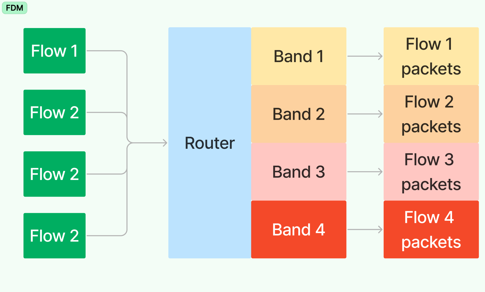
##### TDM

Similar to FDM, here the multiplexing is done on a time domain. This means that a singular *time slot* of a router is divided into *N*. Say each time slot lasts for *10 ns*, and there are *N = 10* connections. Each connection simply gets its own slot of *1 ns* to transmit whatever it has. If there is nothing to transmit, the time slot is simply wasted. While this wastage happens, the connection can be guaranteed that it will receive a certain amount of bandwidth at that router.

In both of these methods (TDM and FDM), deleting and updating connections can be a bit of a hassle. Suppose a connection goes offline, do the new connections get the remaining share divided equally or do they retain their old share expecting the addition of a new connection soon? These questions can be answered by signing a `Service Level Agreement (SLA)` between the clients and the service providers. Since circuit switching only makes sense for long term connections like voice calls and video calls (not that they use it currently), it only makes sense to have one of these agreements to provide users a better experience.

Another thing that you might have noticed is that circuit switching is not going to be very good at handling `Variable Bit Rate (VBR)` conditions. Its meant for `Constant Bit Rate (CBR)` where it promises to respond with expected behaviour. VBR can occur with high resolution video buffering or online multi-player video games. You might have noticed a metric called `ping` in one of these. It simply refers to the average amount of time taken for a packet to be sent and received (something like an RTT). Therefore, the lower it is, the better. For accommodating VBR, there are methods like `VCS (Virtual Circuit Switching)` and `MPLS (Multi-Protocol Level Service)` that can be used. They bring the best of both world (circuit and packet switching).

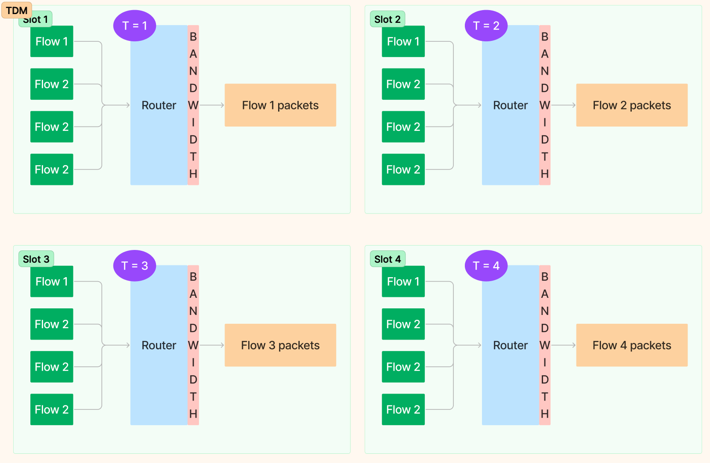

**Note:** These VBR services don't usually use TCP since it comes with its own overhead of a lot of confirmations. They usually use an alternative called `User Datagram Protocol (UDP)` which is less reliable but provides more speed because it doesn't do as many checks as TCP. Hence, something like a file transfer would use TCP where loss of data renders the entire process wrong. You wouldn't want to read only bits and pieces of this blog post now would you?

### Level 7: Packet Forwarding

Let's delve deeper into L3 now. How does a router know where to forward a packet upon receiving it? We know in the case of circuit switching, it reads the header and ships it forward in a slot. The slot decides the next router in line (decided while establishing the connection based on available resources).

In the case of packet switching, the router reads two things
- Source IP
- Destination IP

Furthermore, there are two types of forwarding
- Class based routing
- Class independent routing (CIDR)

Both of these methods operate on the basic principle of `Longest Prefix Matching (LMP)`. If the longest prefix (in case of overlapping prefixes) is not the highest priority rule, the ruleset is inconsistent and it's redundant.
#### Class Based Routing

There are rules defined in the router based on the parameters that it can read. This could be
- Source IP
- Destination IP
- Packet size
- $\dots$

Each rule has its own pre-decided priority and these are arranged highest to lowest. The router checks the current packet with each of these and assigns it a *class/category* corresponding to that rule. Each rule has an output configuration which the router simply ships the packet to. Simple. That's it!
1. Read the packet
2. Match the rule with the highest priority
3. Forward it to the router corresponding to that rule

**Note:** There is always a **default** rule just in case none of the rules are matched.

There are many ways to find the matching rule (or set of rules) like
- Hierarchical Tries
- Set Pruned Tries
- Grid of Tries
- Bit Vector Method
- TCAMs (Ternary Content Addressable Memory)

I've explained the last two methods here because they're both easy to understand and widely used. Both of them are also much closer to hardware implementations, hence they're faster.
##### Bit Vector Method

Create an `N-bit` vector where *N* is the number of rules. For each parameter in the ruleset, parallelly check the applicability of each rule (this is done using a search trie, explained in classless routing). Say there are 5 rules and 2 parameters, for the first parameter, rules 1 and 3 match whereas for the second parameter, rules 2, 3 and 5 match. Therefore the bit vectors for each would look like
- Paramater 1 -> `10100`
- Parameter 2 -> `01101`

We then proceed to do a `bitwise AND` on these vectors and it results in `00100`. Out of this, we take the most significant `1` and apply the corresponding rule. In this case, that would be rule `#3`.

The only issue with this method is that once the ruleset grows in size, it gets harder to store the bit vectors. Imagine having a bit vector of length *1 million*. A simple bitwise AND operation would take significant computation time. However, this works brilliantly for smaller rulesets.

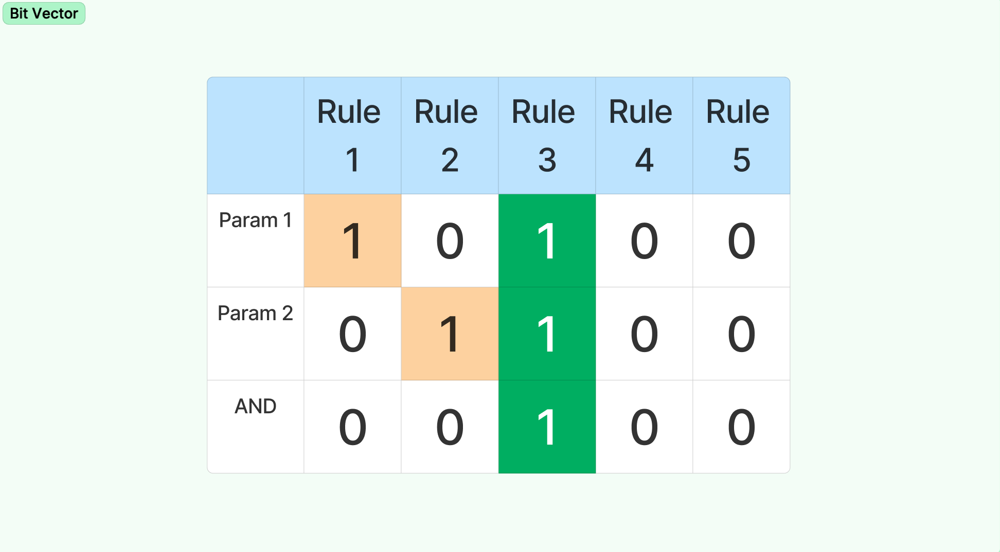

##### TCAMs (Ternary Content Addressable Memory)

This implementation is purely in hardware which makes it extremely efficient. The primary difference between this and the Bit Vector Method is that the matching happens in hardware here. How is that possibly you may ask? You would've come across terms like `RAM` and `ROM` which are usual. You give them an address and they give you the data in that address. `CAM`s are a special type of memory where you essentially give it the *content/data* and it's able to map it to the address.

Therefore all fields for all rules are stored in TCAM banks and the comparisons for a given input are done in parallel. The hardware then does an efficient intersection operations (basically a bitwise AND, but not exactly) and spits out the matched rule with the highest priority. This is where the *ternary* part comes into play. The TCAM banks allow for a third state apart from `0` and `1` which is conventionally called `X`. This state is allowed to match with both `0` and `1` in layman's terms.

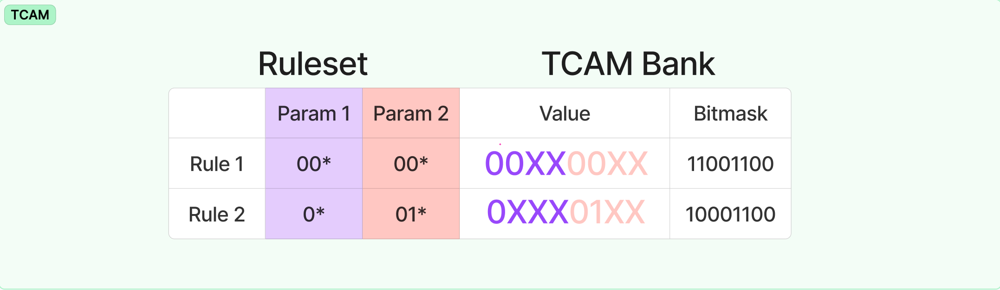

#### Class Independent Routing (CIDR)

This is simpler to understand. Each router maintains what's known as a *forwarding table*. This table contains IP pairs (dest IP -> next IP). What that means is, the router already knows the best possible path that a packet can take for a particular destination IP. It simply chooses the next router in line for that particular destination IP and forwards it there. Again, simple. That's it!

Where this stuff gets hard is updating and deleting rules in the forwarding table (for classless/class based). Let's take a look at what the rules look like:

| Destination IP | Next IP    |
| -------------- | ---------- |
| 10.8.5.*       | 15.25.12.1 |
| 10.8.*         | 15.26.13.2 |
| $\dots$        | $\dots$    |
**Note:** The `*` means that anything after that is not considered, so for entry `#2`, two different IPs `10.8.6.7` and `10.8.7.6` are the same and it will forward both of them to `15.26.13.2`.

This is an example of a CIDR forwarding table. There are usually over **a million** entries in this table. Do you go through every entry? Well that's one way, but its gonna cost you a lot of time. Think about the speed at which the Internet works. Each request you make takes just a few **milliseconds** to execute. Say it has to go through `10` routers and back on it's way, the time it gives for an IP forwarding lookup is practically `0`. Keep in mind, some of these routers are far away and the packet can travel at a maximum speed equal to the speed of light. This delay is actually not negligible. It's actually much larger than an IP lookup usually. Don't believe me? Pull out a calculator and try. This brings to perspective how remarkable the engineering behind this is.

Anyway without digressing, let's discuss how the IP lookup actually happens. For starters we need to think about the IP as `bits` of information instead of the usual dotted notation.
Each dot separation corresponds to `8 bits` of information. So our example of `10.8.*` becomes `00001010.00001000.*` and the packet received (`10.8.7.6`) becomes `00001010.00001000.00000111.00000110`. The dots are merely there for representation. They don't actually exist in the IP.

Each packet is passed through a binary trie with edges `0` and `1` at every node. The nodes that are encountered are collected throughout the process and at the end, the last one encountered that corresponds to a rule is chosen. Simple enough? I know it's not. The diagram below should help.

**Note:** The nodes are marked for each rule whenever there is an update in the forwarding table, so it's all a part of pre processing and it doesn't take up any actual run time.

For the DSA geeks, the time complexity of this approach is `O(W)` where `W` is the number of bits in the longest prefix in the forwarding table. You can see why this approach is much better than individually going through all rules and seeing which one matches. We've moved from a `O(N * W)` to a `O(W)` algorithm. This means we can have as many rules as we want.

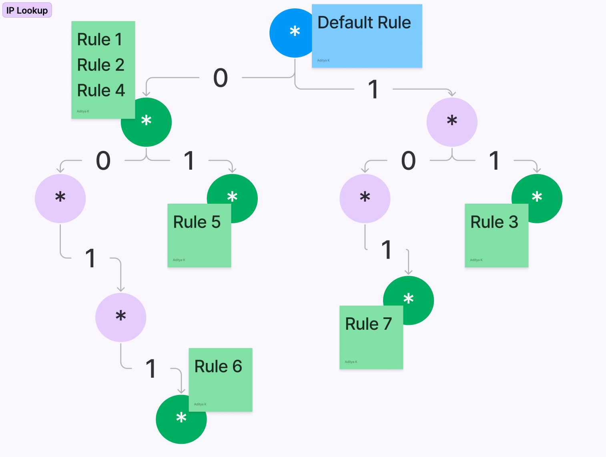

### Level 8: Where Am I?

All discussions till now have been assuming that we know the IP of each and every entity that we interact with. How is an IP assigned though? This is where a protocol called `DHCP (Dynamic Host Configuration Protocol)` comes into play. But before we get into that, let's discuss *subnet masks*. You might've encountered this term while setting up your Wi-fi connection.

As the name suggests, it's a mask over your current IP. Why is this mask needed? Think about it, what's the maximum number of unique IPs we can have? It's just $2^{32}$ where 32 is the number of bits in our IPv4. While this number seems humungous, its only about `4.3` billion. That's actually not a lot of machines. In fact, IPv6 was invented just because of this constraint. That however supports an astronomically large number of IPs so we don't need to worry about that running out anytime soon.

Therefore, a subnet mask says that a particular device belongs to a subset of a massive network and it can be uniquely identified once a common node is reached. This node is usually a router that supports a large number of connections. Therefore, for a globally unique IP, we need a lot of branching with IPv4. The netmask is just a string of `1`s followed by a string of `0`s that combine to form 32 bits. It might look like `11111111.11111111.00000000.00000000` which is just `255.255.0.0`. What it says is, ignore the first `16` bits and route the packet within the current subnet based on its last `16` bits. This supports another $2^{16}$ subnets (not individual machines). Therefore this cascading allows each machine to have a globally unique IP. The netmask is unique to each router, therefore it can choose to have as many subnets within it (limited by 32 bits of course).

Time to revisit `DHCP`. How is the IP assigned to a machine that joins the network? It turns out, its quite simple. Just look for a free IP in the nearest subnet and take that. If the current subnet lies from `255.255.255.101` to `255.255.255.120` (both inclusive) and there already `10` machines on this subnet (ordered), just take `255.255.255.111`.

However, when the device changes its network, it shouldn't get a new IP since it has some context remaining on the Internet. Therefore we would prefer it have the same IP. This leads to the first common router being updated with an exception rule for this particular IP. Now it probably makes sense why a router can have millions of entries in a forwarding table.

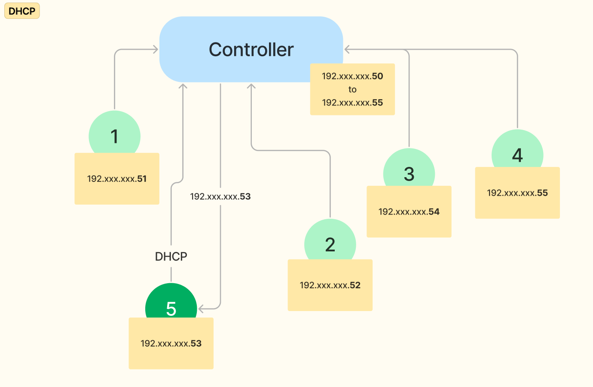

Here node `5` is requesting a new IP from the controller for this subnet and it responds with a free IP available under it's purview.
### Level 9: The Final Layer

So far, you have gained a pretty advanced understanding of layers 7 through 3. It's time to delve into the last layers *viz.* `L2` (L1 is the physical layer which deals with signals, I won't be covering that here). This layer is called the `Data Link Layer`. The most widely used term that applies here is probably `Ethernet`. As the name suggests, this is at a very local level like simple cable connections or a Wi-fi. It is quite similar to L3 in a way. They both operate on a unique ID for each node in a network and they both follow their own protocols for sending and receiving data.

L2 uses a `MAC (Medium Access Control)` address for transmitting data between end points. Unlike an IP, this ID is globally unique. It looks something like this `XX:XX:XX:XX:XX:XX` where each `X` is a hexadecimal digit. That means there are $16^{12}$ total possible MAC addresses. That's over *280 trillion* unique IDs.

There are mainly two kinds of link layers
- Point-to-point
- Broadcast (shared medium)

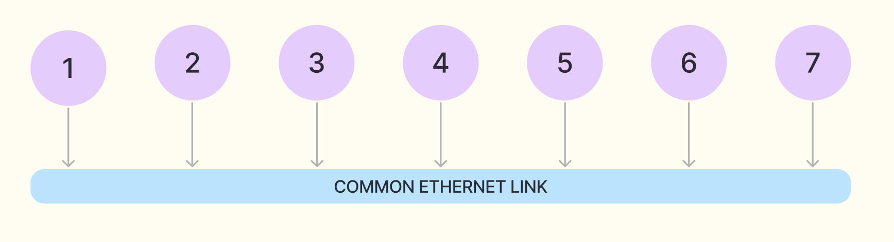

We discuss broadcast here since that's of primary interest and point-to-point is straightforward (as the name suggests).

There are several protocols that L2 uses, some of which are
- Aloha
- Slotted Aloha
- CSMA/CD (Carrier Sensing Multiple Access / Collision Detection)
- CSMA/CA Carrier Sensing Multiple Access / Collision Avoidance)

For simplicity, I've explained the pure `Aloha` protocol. The others are just variations of this to reduce redundancy. The premise for this algorithm is that all of the nodes in the network are linked with the same cable (wireless has a bunch of different stuff going on). The cable can only transmit one signal at a time and if two nodes try to send a signal simultaneously, it results in a `collision` which needs to be minimised (or prevented in the case of Slotted Aloha and CSMA/CD).

A basic method to resolve this that might occur to you is simple using `TDM`, and that is a very viable route. What we're aiming for here is a `Random Access` protocols which allow collisions. Why? It's just to ensure no wastage of slots since the overhead in L2 can cause significant delays in L7 and the payload limits are also lower in L2. It's also more adaptable for variable number of flows using the channel and there's no need to synchronise clocks for `TDM` (reduced overhead).

In pure `Aloha`, whenever a node receives a frame, it is immediately broadcasted to the entire network. In case of a collision, the nodes can choose to send the frames again randomly at some point of time hoping that the other frame is not being sent. As you can imagine it's a very inefficient algorithm and it only works `18%` of the time.

**Note:** In CSMA, the nodes first listen to the channel. The frame is sent only if there's no current frame being transmitted. Of course there can still be collisions because of propagation delays between two nodes. This can be handled in the variations `CD` and `CA`.

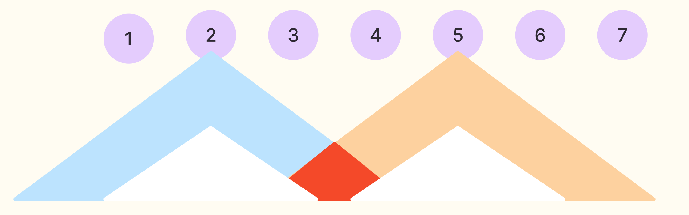

Here, if `2` and `5` decide to start sending their respective frames at the same time, then the red portion represents the collision where the data is corrupted.

### Conclusion

This brings us to the end of the ten levels. I hope this was a good read and you could gain some perspective about how the internet works in general. There are of course deviations from the methods discussed here based on requirements and new developments, but those would be much more comprehensible after this. One thing if you haven't noticed here is that the entire model is a `stack`, which makes it easy to pick out one aspect and dig deeper in it without getting affected by the stuff around it. Which brings me to $\dots$

### What next?

Each aspect of this network stack has its own intricacies and new developments. For example
- The simple `server` that we discussed in the beginning can be modelled in tonnes of different ways
- `TCP` is not the only transport layer protocol. It's actually not preferred for stuff like video streaming where we want speed more than reliability
- We treated routers as a blackbox here, but the inner workings open up another world of algorithms and protocols
- $\dots$

You can simply pick out the thing you found most intriguing and dig deeper, all thanks to the `stack`.
